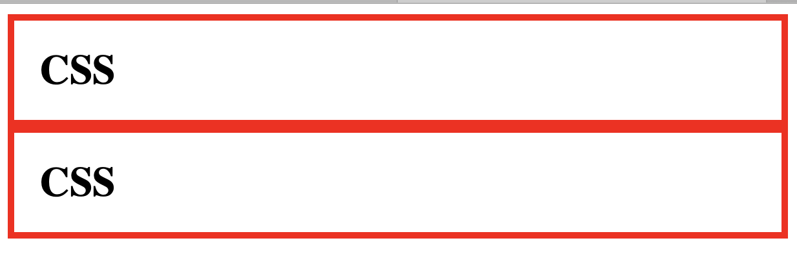

# 박스 모델

## block level element, inline element

태그는 화면 전체를 차지하는 태그와 자신의 컨텐트 크기만큼만 차지하는 태그로 나뉜다. 전자의 경우 block level element 이며 후자가 inline element 이다. display 속성을 이용해 inline, block 값을 통해 기본 속성값을 변경할 수 있다.

### h1 태그와 a 태그의 비교

~~~
<!DOCTYPE html>
<html>
    <head>
        <meta charset="utf-8">
        <title></title>
        
    </head>
    <body>
        <h1>CSS</h1>
        Cascading Style Sheets (<a href="https://www.naver.com">CSS</a>) is a style sheet language used for describing the presentation of a document written in a markup language such as HTML.[1] CSS is a cornerstone technology of the World Wide Web, alongside HTML and JavaScript.[2]
    </body>
</html>
~~~

## 중복 제거

~~~
<!DOCTYPE html>
<html>
    <head>
        <meta charset="utf-8">
        <title></title>
        
    </head>
    <body>
        <h1>CSS</h1>
        Cascading Style Sheets (<a href="https://www.naver.com">CSS</a>) is a style sheet language used for describing the presentation of a document written in a markup language such as HTML.[1] CSS is a cornerstone technology of the World Wide Web, alongside HTML and JavaScript.[2]
    </body>
</html>
~~~

## padding

컨텐트와 테두리사이의 여백

~~~
<!DOCTYPE html>
<html>
    <head>
        <meta charset="utf-8">
        <title></title>
        
    </head>
    <body>
        <h1>CSS</h1>
    </body>
</html>
~~~

## margin

테두리 사이의 여백

### margin = 0
~~~
<!DOCTYPE html>
<html>
    <head>
        <meta charset="utf-8">
        <title></title>
        
    </head>
    <body>
        <h1>CSS</h1>
        <h1>CSS</h1>
    </body>
</html>
~~~

### margin = 20

~~~
<!DOCTYPE html>
<html>
    <head>
        <meta charset="utf-8">
        <title></title>
        
    </head>
    <body>
        <h1>CSS</h1>
        <h1>CSS</h1>
    </body>
</html>
~~~

