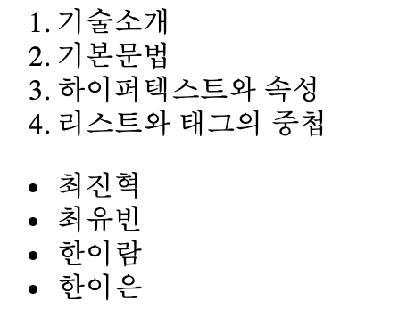

# 1. html 이란

~~~
HyperText Markup Language
~~~

* HyperText: 하이퍼 텍스트를 가장 중요한 특징으로 하는..(링크)
* Markup 마크업이라는 문법 형식을 가진...
* Language: 프로그래밍 언어이다.

## 1.1 프로그래밍 언어

언어란 의미를 전달하기 위한 도구라고 볼 수 있다. 사람과 컴퓨터가 서로 소통하기 위한 
도구, 즉 언어를 컴퓨터 프로그래밍 언어이다. 

## 1.2 HTML

html은 사람과 웹 브라우저가 서로 소통하기 위한 언어로 볼 수 있다.

* 웹 브라우저에 표시되는 웹페이지를 만들어달라고 요청하는 언어
* 사람과 웹 브라우저 간의 약속
* 웹 브라우저에게 명령할 수 있는 언어

---

# 2.html 문법

html 문법 즉 의미를 전달하는 방법은 다음과 같다.
* tag
* 속성

~~~
Hypertext Markup Language
~~~

마크업 언어(Markup Language)이며 링크(Hypertext)로 연결된 웹페이지들을 요청할 수 있는 언어이다. 

## 2.1 tag의 의미

* html은 tag라는 문법을 통해 의미를 전달한다. 보통 html은 골격, 틀을 지정한다.
* 열리는 태그 닫히는 태그로 구성된다.
* html에서 가장 중요한 문법이며 특징이다. 또한 markup과 밀접한 관계를 가지고 있다.
* 태그 안의 대상을 태그가 가진 의미 또는 속성을 추가하여 웹 브라우저에게 특정 의미를 요청한다.

~~~`
a.html

a-> 파일 이름
html-> 확장자, 운영체제는 확장자를 확인하여 지정된 해당 프로그램을 통해 파일을 연다.
~~~
 
## 2.2 tag의 중첩

* 태그는 중첩으로 사용이 가능하다. 

항목의 성격이 다를 때 시각적으로 구분시키기 위해 성격이 같은 항목들을 묶어 구분시켜 준다. 성격이 동일한 것 끼리 태그들을 그루핑 시켜준 것이다.

### li와의 중첩 사용

* ol(ordered list) 태그 
* ul(unordered list) 태그

~~~
<ol>
    <li>기술소개</li>
    <li>기본문법</li>
    <li>하이퍼텍스트와 속성</li>
    <li>리스트와 태그의 중첩</li>
</ol>

<ul>
    <li>최진혁</li>
    <li>최유빈</li>
    <li>한이람</li>
    <li>한이은</li>
</ul>
~~~

