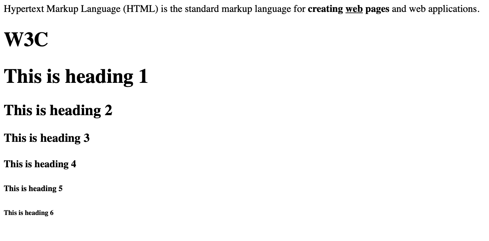

# Html

* HyperText Markup Language
* 웹은 저작권이 없는 public domain이다. 
* 오픈소스이며 접근성이 뛰어나다. 
* html 문법은 태그와 태그의 속성으로 구성된다.

---

## 태그(TAG)
* 설명하는 문법이며 웹을 지배하는 문법
* <> 열리는 태그와 </> 닫히는 태그로 구성
* css 를 통해서 속성을 조절할 수 있기 때문에 의미에 맡는 태그를 우선적으로 사용한다.
* 통계를 기반으로 많이 쓰이는 것을 사용한다. 

~~~
26개 정도의 태그가 주로 쓰인다.
<html> <head> <body> <title> <meta> 
 <a> <script> <link>   
 <li> <ul> <style>   <h2> <input> <h1> <form> <h3> <nav> <footer> <header> <iframe> <button> <strong> <i>
~~~

#### 검색엔진

* 검색엔진은 태그를 근거로 하여 검색 결과를 내보낸다. 
* html을 의미에 맞게 정확하게 작성해야 한다.

~~~

coding

<h3>
coding
</h3>
~~~

### 진하게 강조
<strong></strong>

### 밑줄 강조 (underline)
<u></u>

### h1 태그 추론

<h1></h1>

#### 검색을 통해서 알아보기

* html h1 tag -> <https://www.w3schools.com/tags/tag_hn.asp>
> The <h1> to <h6> tags are used to define HTML headings(제목)

~~~
<h1>This is heading 1</h1>
<h2>This is heading 2</h2>
<h3>This is heading 3</h3>
<h4>This is heading 4</h4>
<h5>This is heading 5</h5>
<h6>This is heading 6</h6>
~~~

### br 줄바꿈 태그

*  
* 닫는 괄호가 없다. 
* 줄 바꿈해준다.
* html new line tag -> <https://www.w3schools.com/tags/tag_br.asp>

### p 단락 태그

* 

* 단락으로 믜미론적으로 표현해준다.
* css를 통해서 바꿀 수 있기 때문에 의미에 먼저 맡게 사용한다. 
* html paragraph tag -> <https://www.w3schools.com/tags/tag_p.asp>
 
## 속성(attribute)

* 태그의 심화된 문법
* 위치는 상관 없다.
* 태그의 이름만으로 정보가 부족할 때 속성을 통해서 더 많은 의미를 부과한 것이다.

~~~

~~~

### img 이미지 태그

* 
* src 속성을 통해 이미지를 로드한다.
* [이미지 무료 사이트](https://unsplash.com/)

## 부모 자식 관계 태그

* 태그는 부모 자식 관계가 존재한다.
* 포함하고 있는 태그와 포함된 태그
* 특정 태그는 부모 또는 자식 태그가 필수인 구조를 가지는 경우가 있다.
* li, ul 태그는 서로 반드시 부모, 자식 간의 태그로 존재해야 한다.

### li 목록 태그

* <Li></li>
* 목록 리스트

### ul(unordered list) 태그

* li 태그의 부모 태그
* li 태그들을 구분 

### ol(ordered list) 태그

* li 태그에 순서를 넘버링 해준다.

### table, tr, td 태그

* <talbe></talbe>, <tr></tr>, <td></td> 3대 태그가 같이 다닌다.

~~~
<table>
    <tr>
        <td>head</td>
        <td>98.1%</td>
    <tr>
    <tr>
        <td>body</td>
        <td>97.9%</td>
    <tr>
    <tr>
        <td>html</td>
        <td>97.9%</td>
    <tr>
</table>
~~~

