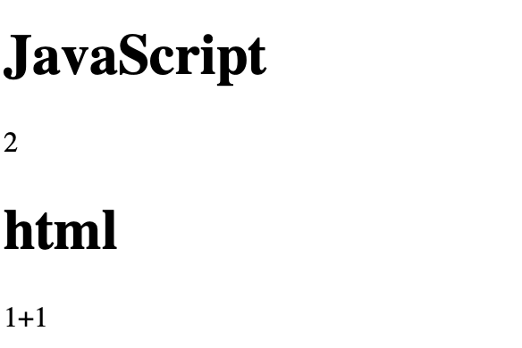
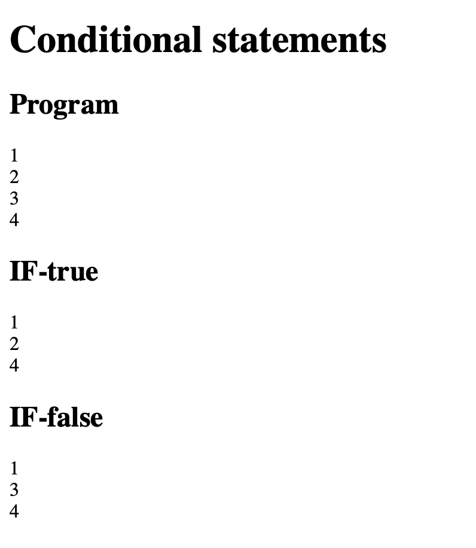
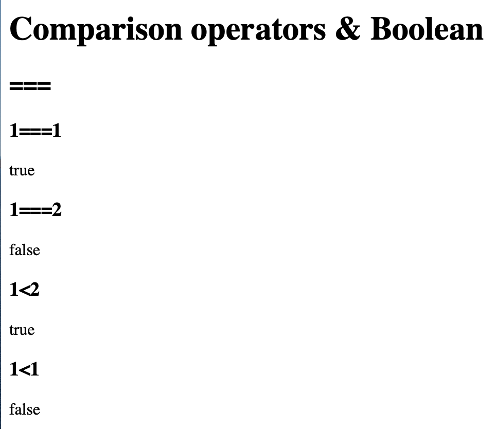
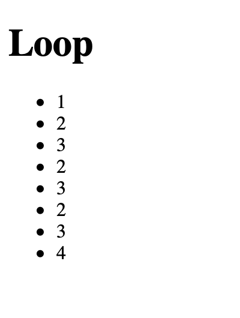
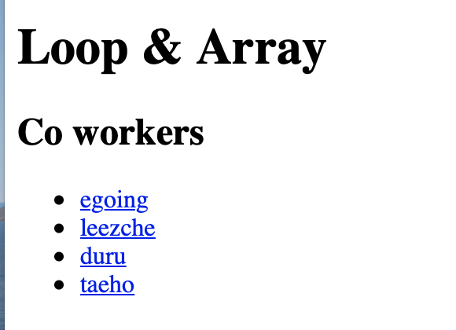

# 자바스크립트 문법

## 자료형

<https://developer.mozilla.org/ko/docs/Web/JavaScript/Data_structures>

### 기본 자료형
* Boolean
* Null
* Undefined
* Number
* String
* Symbol (ECMAScript 6 에 추가됨)
* 별도로 Object 도 있음

자료형에 따라 표현하는 방법과 연산의 종류, 결과가 달라진다. 

#### 숫자
* 숫자는 그대로 사용해서 표현하면된다.
* 숫자는 연산이 중요하다.-> 산술 연산자

#### 문자

* 문자 따옴표로 표현한다.
* 문자열에서는 유용한 기능들이 있다.

---

## 변수와 대입 연산자

### 변수(variable)

* 바뀔 수 있는 어떤 값

~~~
1 = 2 
~~~

* 1은 항상 바꾸지 않는 상수이기 때문에 변수와 달리 값을 할당할 수 없다. 

### 대입 연산자

* 오른쪽 항에 있는 값을 왼쪽의 변수에 대입한다. 
* 대입은 좌항과 우항을 결합하여 우항의 값을 만들어 낸다.

---

## 조건문

* 하나의 프로그램이 하나의 흐름으로 가는 것이 아니라 조건에 따라서 다른 순서의 기능들이 실행되도록 한 것

* if 뒤에는 boolean 데이터 타입이 온다.

* script 태그 내에 if 문을 작성하면 된다. 

~~~
<!DOCTYPE html>
<html>
    <head>
        <meta charset="utf-8">
        <title></title>
    </head>
    <body>
        <h1>Conditional statements</h1>
        <h2>Program</h2>
        
        <h2>IF-true</h2>
        
        <h2>IF-false</h2>
        
    </body>
</html>
~~~

### 토글 구현하기

* 하나의 버튼으로 여려 기능을 하게 한다. 

---

## 비교 연산자와 Boolean 데이터 타입

### 비교 연산자

* 좌항과 우항과 결합해 boolean 데이터 타입을 만들어낸다.
* 두 값을 비교해 같은지 다른지 비교를 해준다.-> 대입 연산자
* 두 값의 크기를 비교해준다. -> 비교연산자 
* True 또는 False 값 중 하나를 만들어 낸다.

~~~
<!DOCTYPE html>
<head>
    <meta charset="utf-8">
    <title></title>
</head>
<body>
    <h1>Comparison operators & Boolean</h1>
    <h2>===</h2>
    <h3>1===1</h3>
    
    <h3>1===2</h3>
    
    <h3>1&lt;2</h3>
    
    <h3>1&lt;1</h3>
    
</body>
~~~

### Boolean 데이터 타입

* True, False 두 개의 데이터로 이루어진 타입이다. 

---

## 배열

* 데이터가 많아짐에 따라 정리하는 방법이 필요하다. 
* 선언 및 push, 길이 출력

~~~
<!DOCTYPE html>
<html>
    <head>
        <meta charset="utf-8">
        <title></title>
    </head>
    <body>
        <h1>Array</h1>
        <h2>Syntax</h2>
        
        <h2>get</h2>
        
        <h2>add</h2>
        
        <h2>count</h2>
        
    </body>
</html>
~~~

## 반복문

* 반복문의 종료지점을 잘 설정해야 한다.

~~~
<!DOCTYPE html>
<html>
    <head>
        <meta charset="utf-8">
    </head>
    <body>
        <h1>Loop</h1>
        <ul>
        
        </ul>
    </body>
</html>

~~~

## 반복문과 배열

~~~
<!DOCTYPE html>
<html>
    <head>
        <meta charset="utf-8">
    </head>
    <body>
        <h1>Loop & Array</h1>
        
        <h2>Co workers</h2>
        <ul>
            

        </ul>
    </body>
</html>

~~~

