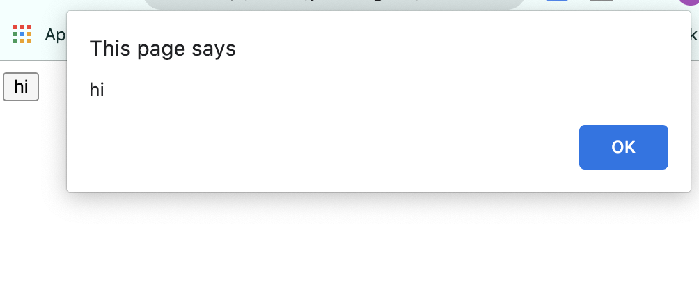

# JavaScript

* 사용자와 상호작용을 가능하게 하는 언어이다.
* 웹 브라우저는 한 번 화면에 표시하면 자기 자신을 바꿀 수 있는 능력은 없다. 이 기능을 자바 스크립트가 할 수 있다.
* 자바스크립트는 html을 제어하는 언어이다. 
* html 위에서 작동하는 언어로 시작되었다.

## html위에서 자바스크립트 작성하기

* 웹 브라우저에게 html 문법으로 자바스크립트 시작점을 알려준다
* 

        <h1>html</h1>
        <!-- html  -->
        1+1
    </body>
</html>
~~~

## 이벤트

* 사용자와 상호작용하는데 핵심이다.

### 버튼 생성

* input 태그 사용하기
* onclick의 속상값은 자바스크립트 문법이 작성된다. 
* 웹브라우저는 onclick의 속성값을 기억하고 있다가 해당 태그에 사용자가 클릭했을 때 기다리고 있었던 자바스크립트 코드를 자바스크립트 코드의 문법대로 실행한다.

~~~
~~~

#### 이벤트

* on시작되는 속성을 지정하여 이벤트를 다룬다. 
* 웹브라우저 위에서 일어나는 일들
* 이벤트가 발생했을 때 어떤 자바스크립트 코드를 실행시킬 수 있는 속성이 onclick 이다. 
* 웹 브라우저에서 일어날 수 있는 이벤트가 정의되어 있다.
* 이벤트를 통해 사용자와 상호작용할 수 있도록 웹 페이지를 구현한다. 

---

## 콘솔 이용하기

* 파일을 만들지 않고 자바스크립트 코드를 직접 사용한다. 
* 콘솔에서 작성되는 자바스크립트는 해당 웹페이지 대상으로 실행된다. 
* sns내에서 특정 요소를 대상으로 랜덤 추출이 가능하다. 
