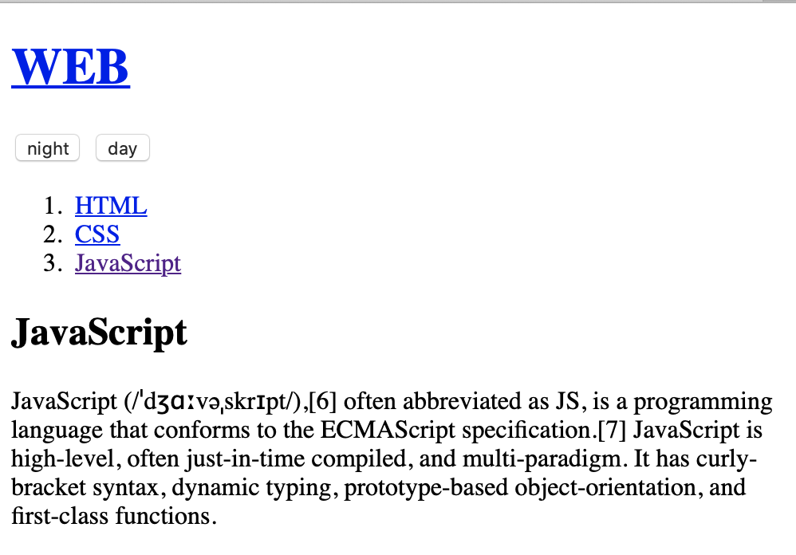
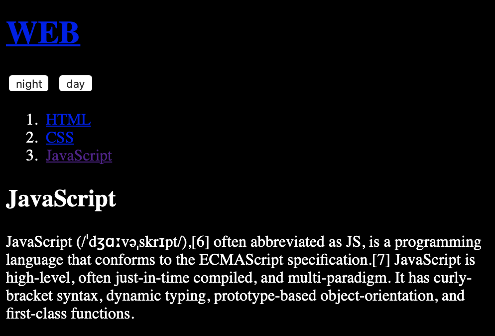
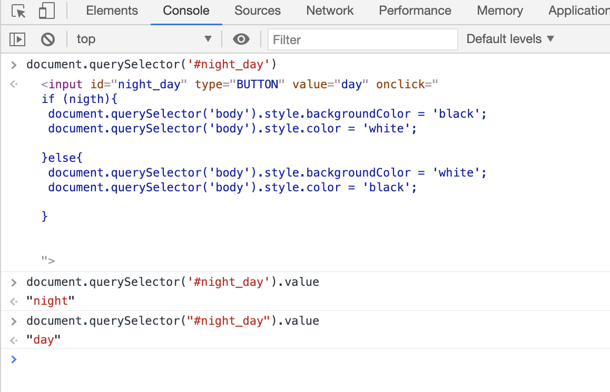

# 1. 제어할 태그 선택하기

## 배경 색 바꾸기

* input 태그를 통해 버튼 두개를 생성한다.
* 버튼의 onclick 속성을 통해 이벤트를 처리한다.
* 처리할 이벤트는 바디 태그의 스타일 속성을 통해 배경 속성 값을 바꾸는 것이다.

~~~
document.querySelector('body').style.backgroundColor('') 
~~~

바디 태그의 스타일 속성을 접근한 후 배경색 속성값을 변경시킬 수 있는 함수의 형태이다. 

~~~
<!doctype html>
<html>
    <title>WEB1 - JavaScript</title>
    <meta charset="utf-8">
</html>
<body>
<h1><a href="index.html">WEB</a></h1>
<input type="button" value="night" onclick="
 document.querySelector('body').style.backgroundColor = 'black';
 document.querySelector('body').style.Color = 'white';
">
<input type="button" value="day" onclick="
document.querySelector('body').style.backgroundColor = 'white';
document.querySelector('body').style.Color = 'black';
">
<ol>
    <li><a href='1.html'>HTML</a></li>
    <li><a href='2.html'>CSS</a></li> 
    <li><a href='3.html'>JavaScript</a></li> 
</ol>

<h2>JavaScript</h2>
JavaScript (/ˈdʒɑːvəˌskrɪpt/),[6] often abbreviated as JS, is a programming language that conforms to the ECMAScript specification.[7] JavaScript is high-level, often just-in-time compiled, and multi-paradigm. It has curly-bracket syntax, dynamic typing, prototype-based object-orientation, and first-class functions.
</body>

~~~

### day 버튼 누를 경우

### night 버튼 누를 경우

---

# 2. 리펙토링

* 동작은 그대로 두고 코드의 효율성을 높이며 중복된 코드를 낮추는 코드를 개선하는 작업

## this

* 자신의 태그를 가리킬 경우

~~~
<input id = "night_day2" type="BUTTON" value="night" onclick="
if (document.querySelector('#night_day2').value === 'night'){
 document.querySelector('body').style.backgroundColor = 'black';
 document.querySelector('body').style.color = 'white';
 document.querySelector('#night_day2').value = 'day'

}else{
 document.querySelector('body').style.backgroundColor = 'white';
 document.querySelector('body').style.color = 'black';
 document.querySelector('#night_day2').value ='night'
}
">
~~~

~~~
<input  type="BUTTON" value="night" onclick="
if (this.value === 'night'){
 document.querySelector('body').style.backgroundColor = 'black';
 document.querySelector('body').style.color = 'white';
 this.value = 'day'

}else{
 document.querySelector('body').style.backgroundColor = 'white';
 document.querySelector('body').style.color = 'black';
 this.value ='night'
}
">
~~~

~~~
<!doctype html>
<html>
    <title>WEB1 - JavaScript</title>
    <meta charset="utf-8">
</html>
<body>
<h1><a href="index.html">WEB</a></h1>
<input  type="BUTTON" value="night" onclick="
if (this.value === 'night'){
 document.querySelector('body').style.backgroundColor = 'black';
 document.querySelector('body').style.color = 'white';
 this.value = 'day'

}else{
 document.querySelector('body').style.backgroundColor = 'white';
 document.querySelector('body').style.color = 'black';
 this.value ='night'
}
"><ol>
    <li><a href='1.html'>HTML</a></li>
    <li><a href='2.html'>CSS</a></li> 
    <li><a href='3.html'>JavaScript</a></li> 
</ol>
<h2>JavaScript</h2>

JavaScript (/ˈdʒɑːvəˌskrɪpt/),[6] often abbreviated as JS, is a programming language that conforms to the ECMAScript specification.[7] JavaScript is high-level, often just-in-time compiled, and multi-paradigm. It has curly-bracket syntax, dynamic typing, prototype-based object-orientation, and first-class functions.

<input  type="BUTTON" value="night" onclick="
if (this.value === 'night'){
 document.querySelector('body').style.backgroundColor = 'black';
 document.querySelector('body').style.color = 'white';
 this.value = 'day'

}else{
 document.querySelector('body').style.backgroundColor = 'white';
 document.querySelector('body').style.color = 'black';
 this.value ='night'
}
">
</body>
~~~

## 중복 제거

* 변수화를 통해서 중복을 제거한다.
* target 내용만 바꾸면 모두 바뀌게 된다.

~~~
var target = document.querySelector('body')
~~~

---

# 3. 반복문의 활용

* 가장 앞에 있는 태그 하나 가져온다.
~~~
document.quertySelector('a')
~~~

* 태그 여러개 가져온다.
~~~
document.querySelectorAll('a')
~~~

* 변수화 하여 특정 태그 가져오기
~~~
var alist = document.querySelector('a')
console.log(alist[1])
~~~

* 반복문 사용하여 확인한다.
~~~
var alist = document.querySelectorAll('a');
var i = 0;
while(i < alist.length>){
    console.log(alist[i]);
    i = i+1;
}
~~~

* 스타일 적용하여 바꾼다. 
~~~
var alist = document.querySelectorAll('a');
var i = 0;
while(i < alist.length){
    console.log(alist[i]);
    alist[i].style.color = 'powderblue';
    i = i+1;
}
~~~

---

# 4. 조건문의 활용

## 현재 value 값이 무엇인지 알고 조건문을 작성한다.

~~~
<input id = "night_day" type="BUTTON" value="night" onclick="
if (nigth){
 document.querySelector('body').style.backgroundColor = 'black';
 document.querySelector('body').style.color = 'white';

}else{
 document.querySelector('body').style.backgroundColor = 'white';
 document.querySelector('body').style.color = 'black';

}
">
~~~

* javascript element get value 검색 -> stackoverflow

~~~
document.querySelector('#night_day')
document.querySelector('#night_day').value()
document.querySelector('#night_day').value()
~~~

## web 코드 수정

* 조건문을 통해 day, night 버튼 하나로 통일

~~~
<!doctype html>
<html>
    <title>WEB1 - JavaScript</title>
    <meta charset="utf-8">
</html>
<body>
<h1><a href="index.html">WEB</a></h1>

<input id = "night_day" type="BUTTON" value="night" onclick="
if (document.querySelector('#night_day').value === 'night'){
 document.querySelector('body').style.backgroundColor = 'black';
 document.querySelector('body').style.color = 'white';
 document.querySelector('#night_day').value = 'day'

}else{
 document.querySelector('body').style.backgroundColor = 'white';
 document.querySelector('body').style.color = 'black';
 document.querySelector('#night_day').value ='day'
}
">
<ol>
    <li><a href='1.html'>HTML</a></li>
    <li><a href='2.html'>CSS</a></li> 
    <li><a href='3.html'>JavaScript</a></li> 
</ol>

<h2>JavaScript</h2>
JavaScript (/ˈdʒɑːvəˌskrɪpt/),[6] often abbreviated as JS, is a programming language that conforms to the ECMAScript specification.[7] JavaScript is high-level, often just-in-time compiled, and multi-paradigm. It has curly-bracket syntax, dynamic typing, prototype-based object-orientation, and first-class functions.
</body>

~~~
---

# 5. 함수 활용

* 매개변수 this, self 주의

~~~
<!doctype html>
<html>
    <head>
        <title>WEB1 - JavaScript</title>
        <meta charset="utf-8">
        
    </head>

    <body>
        <h1><a href="index.html">WEB</a></h1>
        <input  type="BUTTON" value="night" onclick="
            nightDayHandler(this);
        ">
        <input  type="BUTTON" value="night" onclick="
        nightDayHandler(this);
        ">
        <ol>
            <li><a href='1.html'>HTML</a></li>
            <li><a href='2.html'>CSS</a></li> 
            <li><a href='3.html'>JavaScript</a></li> 
        </ol>
        <h2>JavaScript</h2>
        

        JavaScript (/ˈdʒɑːvəˌskrɪpt/),[6] often abbreviated as JS, is a programming language that conforms to the ECMAScript specification.[7] JavaScript is high-level, often just-in-time compiled, and multi-paradigm. It has curly-bracket syntax, dynamic typing, prototype-based object-orientation, and first-class functions.
        

        <input  type="BUTTON" value="night" onclick="
            if (this.value === 'night'){
            document.querySelector('body').style.backgroundColor = 'black';
            document.querySelector('body').style.color = 'white';
            this.value = 'day'

            }else{
            document.querySelector('body').style.backgroundColor = 'white';
            document.querySelector('body').style.color = 'black';
            this.value ='night'
            }
        ">
    </body>
</html>
~~~

---

# 6. 객체 활용

* 객체화 적용

~~~
<!doctype html>
<html>
    <head>
        <title>WEB1 - JavaScript</title>
        <meta charset="utf-8">
        
    </head>

    <body>
        <h1><a href="index.html">WEB</a></h1>
        <input  type="BUTTON" value="night" onclick="
            nightDayHandler(this);
        ">
        <ol>
            <li><a href='1.html'>HTML</a></li>
            <li><a href='2.html'>CSS</a></li> 
            <li><a href='3.html'>JavaScript</a></li> 
        </ol>
        <h2>JavaScript</h2>
        

        JavaScript (/ˈdʒɑːvəˌskrɪpt/),[6] often abbreviated as JS, is a programming language that conforms to the ECMAScript specification.[7] JavaScript is high-level, often just-in-time compiled, and multi-paradigm. It has curly-bracket syntax, dynamic typing, prototype-based object-orientation, and first-class functions.
        

    </body>
</html>
~~~

---

# 7. 파일로 쪼개기

* 서로 연관된 코드들을 파일로 묶어서 그루핑한다.
* 유지보수가 용이하다. 색깔을 바꿀 수 color.js 에서만 바꾸면 된다. 새로운 웹 페이지를 만들었을 경우 일일이 복사할 필요없이 참조하기만 하면 된다. 

* 새로운 웹 페이지를 만들었을 경우 일일이 복사할 필요없이 참조하기만 하면 된다. 가독성이 좋아지고 코드가 명확해지다. 코드의 의미를 파일의 이름을 통해 파악할 수 있다.

* js 파일에 script 태그의 내용들을 붙여 넣은 후 소스 코드를 스타일 태그 속성을 통해 참조하도록 한다. 색깔을 바꿀 수 color.js 에서만 바꾸면 된다. 

* js 포함한 파일을 또 접속해야 하기 때문에 웹브라우저에게 단점이 될 수 있다. 하지만 캐시로 인해 즉 처음 받은 파일은 저장을 해놓기 때문에 더 효율적으로 페이지를 열 수 있다. 

~~~
    
~~~