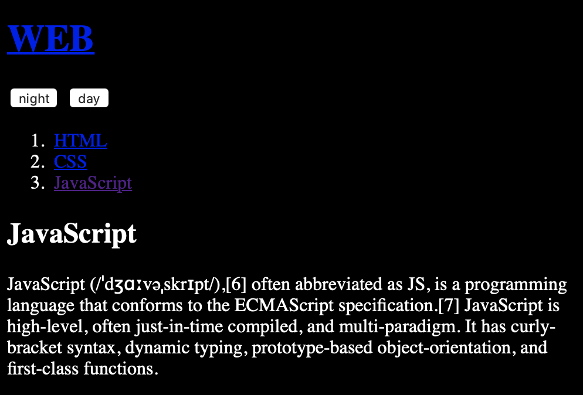

# 제어할 태그 선택하기

## 배경 색 바꾸기

* input 태그를 통해 버튼 두개를 생성한다.
* 버튼의 onclick 속성을 통해 이벤트를 처리한다.
* 처리할 이벤트는 바디 태그의 스타일 속성을 통해 배경 속성 값을 바꾸는 것이다.

~~~
document.querySelector('body').style.backgroundColor('') 
~~~

바디 태그의 스타일 속성을 접근한 후 배경색 속성값을 변경시킬 수 있는 함수의 형태이다. 

~~~
<!doctype html>
<html>
    <title>WEB1 - JavaScript</title>
    <meta charset="utf-8">
</html>
<body>
<h1><a href="index.html">WEB</a></h1>
<input type="button" value="night" onclick="
 document.querySelector('body').style.backgroundColor = 'black';
 document.querySelector('body').style.Color = 'white';
">
<input type="button" value="day" onclick="
document.querySelector('body').style.backgroundColor = 'white';
document.querySelector('body').style.Color = 'black';
">
<ol>
    <li><a href='1.html'>HTML</a></li>
    <li><a href='2.html'>CSS</a></li> 
    <li><a href='3.html'>JavaScript</a></li> 
</ol>

<h2>JavaScript</h2>
JavaScript (/ˈdʒɑːvəˌskrɪpt/),[6] often abbreviated as JS, is a programming language that conforms to the ECMAScript specification.[7] JavaScript is high-level, often just-in-time compiled, and multi-paradigm. It has curly-bracket syntax, dynamic typing, prototype-based object-orientation, and first-class functions.
</body>

~~~

### day 버튼 누를 경우

### night 버튼 누를 경우

